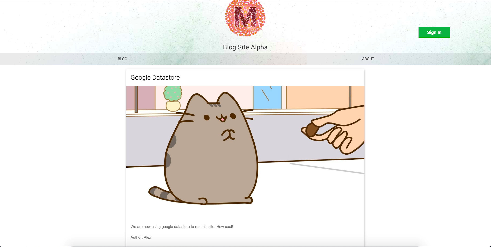

# Blog Site using google cloud services
Blog Site Alpha - Advanced Development Assignment 

This site was used for my advance development assignment in my final year of university .

Blog Site Alpha, is a simple web blog which utilises the different features and functionality on the google cloud platform. 

It is hosted on Google's app engine and take advantage of some of the following features of the platform:

* Google sign in (Oauth)
* Google NoSql Datastore
* Google Storage
* Google app engine, python 3.7 standard environment
* Google IAM service accounts (For connecting and using google services for the website)

The website uses some external entities outside of the Google suite, such as:
* Slack python client, to get/post messages from a website-channel to allow users to send messages
* Trello python client, to enable users to create trello cards on the website's board to report bugs and ask for new features on the site
* Mailjet's email API.

## Game screen & Main menu
 

## View project
[See the Blog site project on github!](https://github.com/AlexMarriott/blog-site-alpha)
